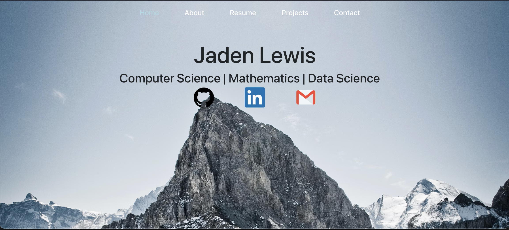
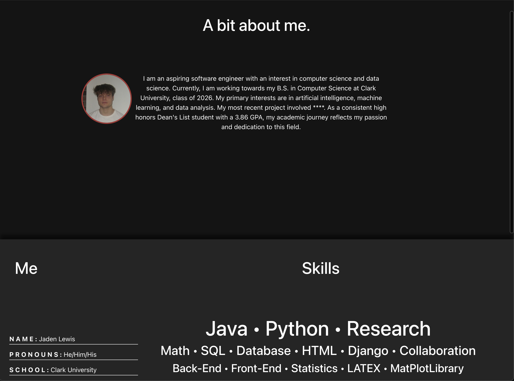

# Personal Website

This is my personal website, built using **React**, **HTML**, **CSS**, and **JavaScript**. I created it to showcase my work, projects, and experience while learning how modern web development works from the ground up.

> Site is no longer live

---

## 🚀 Features

- **Home Page** with brief intro and profile picture
- **Projects Section** showcasing key software and project work
- **About Me** page with academic background and interests
- **Responsive Design** for desktop and mobile screens
- **Custom Styling** using CSS and component layout with React

---

## Tech Stack

- **React**
- **JavaScript**
- **HTML5 / CSS3**
- **GitHub Pages** for hosting (Site is no longer live)

---

## Screenshots

> Place screenshots in a folder named `/assets` inside your repo, then reference them like this:

```markdown

